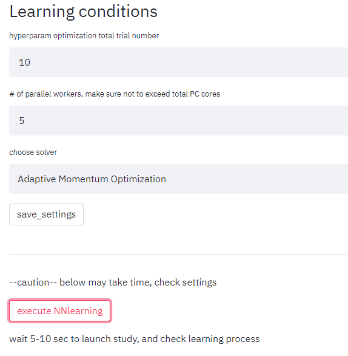

# MatInterp

ニューラルネットを用いて3次元曲面補間を行うアプリケーション [MatInterp](https://github.com/kensei-te/mat_interp) を導入し適当な問題で動かせるようする．
Windows 環境はサポート外であることと，2022/10/17 現在，公式マニュアルの説明と最新バージョンのソフトに齟齬があると思われるため，「こうやったら動いた」という情報を記録する．

## Setup

Windows は未対応のため WSL を用いる．

### Python 環境の構築

WSL の `Ubuntu 20.04.3 LTS` を使用．Anacondaがインストールされている．

[MatInterp](https://github.com/kensei-te/mat_interp) を ローカルにクローンし，セットアップ構成を使って conda 環境を作成する．

```sh
cd (local path)/mat_interp/
conda env create -f=env_Ubuntu.yml
conda activate mat_interp
```

### MySQL のインストール

[ニューラルネットワークの最適化処理のデータを並行して扱うために  MySQL を用いている](https://github.com/kensei-te/mat_interp#:~:text=After%20this%20is%20done%2C%20follow%20the%20below%20procedures%20for%20setting%20up%20MySQL%20server%20(local%20database%20used%20to%20take%20care%20data%20of%20optimization%20process%20of%20neural%20networks%20architeture%20in%20parallel.))ため，なければインストールする．

うまく動かなくていろいろいじっている間に環境がおかしくなったため一度アンインストールしている．
参考：[Ubuntu環境でのMySQLアンインストールについて](https://qiita.com/King_kenshi/items/b6f217a8a3083c98904b#ubuntu%E7%92%B0%E5%A2%83%E3%81%A7%E5%AE%8C%E5%85%A8%E3%81%AB%E3%82%A2%E3%83%B3%E3%82%A4%E3%83%B3%E3%82%B9%E3%83%88%E3%83%BC%E3%83%AB%E3%81%99%E3%82%8B%E6%96%B9%E6%B3%95)

```sh
sudo apt-get remove --purge mysql-server* mysql-common
sudo apt-get autoremove --purge
sudo rm -r /etc/mysql
sudo rm -r /var/lib/mysql
```

WLS 越しだとマニュアル通りではうまく動かないようなので [Microsoft のドキュメント](https://learn.microsoft.com/ja-jp/windows/wsl/tutorials/wsl-database#install-mysql) に従う．

```sh
sudo apt update
apt-cache policy mysql-server
sudo apt install mysql-server=(バージョンを指定)
mysql --version
```

1行目で更新があればアップグレードしておく(`sudo apt upgrade`)．
2行目で有効なMySQLバージョンが表示されるので v.8.0.x 系か v.5.7.x を選ぶ．
3行目で該当バージョンをインストールする．
4行目で指定したバージョンが表示されればインストール成功．

パスワードを設定．
`mysql_secure_installation` を使うとなぜかうまくいかないため，まずプロンプトから設定する．
(参考：[MySQL 8.0 mysql_secure_installation エラー](https://server-recipe.com/3865/#toc3))

```sh
$ sudo /etc/init.d/mysql start
$ sudo mysql
mysql> ALTER USER 'root'@'localhost' IDENTIFIED WITH mysql_native_password by '(password)';
mysql> exit;
```

これで `mysql_secure_installation` が通るようになった．
最初の「パスワードを変えるか？」という質問以外すべて `y` で答え，他の設定を終わらせる．
これで root ユーザーにパスワードが設定された状態になる．

再び MySQL サーバーを立ち上げ直し，rootでプロンプトを起動する．
※ 通常，サーバーの起動は `systemctl start mysql` のようにするが，WSL 環境だと `systemctl` が動かないため直接叩く．動かせるようにすることもできる(⇒[Windows 10 or 11 （WSL2）のUbuntuでsystemctlを利用する方法（systemdをPID1で動作させる方法）](https://snowsystem.net/other/windows/wsl2-ubuntu-systemctl/)) ようだが，大変なので一旦このまま．

```sh
sudo /etc/init.d/mysql start
sudo mysql -u root -p
```

パスワードを入力し，プロンプトで MatInterp の設定スクリプトを実行して終了する．

```sql
mysql> source createdb.sql
mysql> exit;
```

以下の内容の MySQL の構成ファイル `~/.my.cnf` を作成する．

```text
[client]
user = mat_user_1
password = mat_user_1_P
```

```sh
echo "[client]
user = mat_user_1
password = mat_user_1_P" >> ~/.my.cnf
```

でいいだろう．

このファイルとレポジトリ内の設定ファイルのアクセス権限を自分だけにする．

```sh
chmod 600 ~/.my.cnf
```

```sh
chmod 600 config.ini
```

セットアップ完了．

## 使用法

### アプリの起動

1. mat_interp の環境を activate する

    ```sh
    conda activate mat_interp
    ```

2. MySQL のサーバーを起動する

    ```sh
    sudo /etc/init.d/mysql start
    ```

3. mat_interp のディレクトリへ移動する

    ```sh
    cd (local path)/mat_interp
    ```

4. GUI アプリを立ち上げる

    ```sh
    streamlit run app.py
    ```

    初回起動には時間がかかる場合がある．
    開発に興味がある方は Email を入力してくださいというプロンプトが出るが無視して Enter を押してよい．

5. ブラウザが立ち上がりアプリが走る．
    自動で起動しない場合は [http://127.0.0.1:8501/](http://127.0.0.1:8501/) にアクセスする．

### アプリの終了

1. ブラウザのページを閉じる
2. コマンドラインで "Ctrl+C" を入力し streamlit を終了する
3. MySQL サーバーを終了する

    ```sh
    sudo /etc/init.d/mysql stop
    ```

### アプリの使用

1. データの準備：
    入力2次元，出力1次元の3つの column を含む CSV ファイルを用意する．
    パラメータ $X_2$ によって  $Y$ vs $X_1$ の曲線の形が変化するというようなデータが想定されている．
    `mat_interp/example_date` にデモ用データが用意されているのでこれを参考に．
2. 左側最上部のフォームにワーキングフォルダ名を入力
    `mat_interp/study/(folder name)` に学習データなどが保存される．
    学習済みのデータがあれば，2つ目のフォームから指定することでモデルが読み込まれるので "STEP 3" へ．
    
3. データファイルを指定する
    左側3つ目のフォームにファイルをドラッグ&ドロップ，または "Browse files" からダイアログで指定．
4. "STEP1: data_preparation"
    + データの column を指定．
        
    + rawdata_plot にチェックを入れると Y vs X1 の曲線が X2 の値で場合分けしてプロットされる．
        
5. "STEP2: model_construction"
    + ハイパーパラメータ探索の回数，並列処理のワーカー数，学習アルゴリズムを選択し，"save_settings" をクリックして保存する[^settings]．
        
    + "execute_NNlearning" をクリックして学習を開始する．
    + "check/update record" をクリックすると学習状況が表示される．
        起動直後でログが生成する前に押すとエラーが出るので少し待ってからにする．
        streamlit を起動したコマンドラインを見るとリアルタイムのログが印字されているので適宜進捗を確認するとよい．
        
    + 学習が完了したら "check_learned_result" にチェックを入れ結果を確認する．
        "visualize learned curves" をチェックするとフィットの具合が表示されるのでうまく行っているか確認する．
        
6. "STEP2.5: revisit past study"
    "STEP2" と同じく保存された学習結果を確認できる．主に学習済みモデルを読み出したとき用．
7. "STEP3: use_model"
    + 予測したい X1，X2 の値を設定する．
        最小値，最大値，ステップ間隔を指定し等間隔のメッシュを作るか，
        "X1 predicted list manual, separated by 'comma'" にチェックを入れ，コンマ区切りの数値リストを直接指定する．
    + "simulate" で Y の値が計算される．
        "show simulated result" をチェックすると rawdata_plot と同様にプロットされる．
        
    + 結果は `mat_interp/study/df_simulated.csv` に保存されている．
        "Download df_simulated.csv" をクリックすれば別途ファイルがダウンロードされる．

[^settings]: これを保存しておかないとエラーになる．マニュアルとは名前が異なっているので注意．

以上．

あくまで入力データを学習した補間に過ぎないので，基本的に外挿はできないものとして扱い，結果が正しいかどうかは良く吟味するべきである．
図7では入力データ外の $X_1<10$ の領域では $X_2$ が大きい領域のデータに引きずられてしまっている．

出典： K. Terashima, et al. "Neural Networks for a Quick Access to a Digital Twin of Scanning Physical Properties Measurements." arXiv, June 22, 2022. https://doi.org/10.48550/arXiv.2206.10908.
