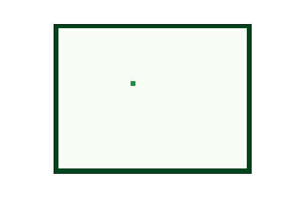
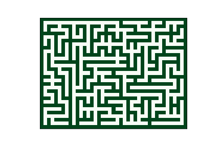
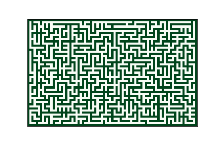
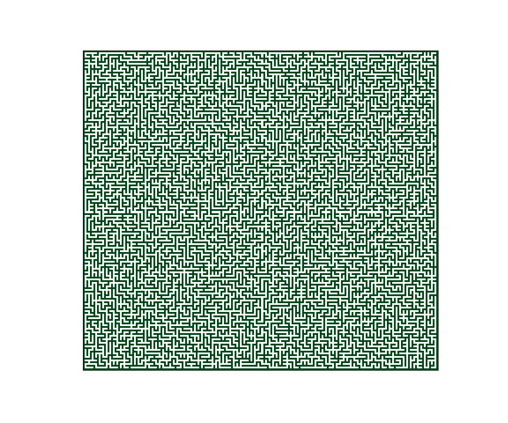

# MazeGenerator

壁伸ばし法によるランダム迷路生成

コードは [maze.py](https://github.com/Y-Saki26/memorandum/blob/main/MazeGenerator/maze.py)，使用法は [maze.ipynb](https://github.com/Y-Saki26/memorandum/blob/main/MazeGenerator/maze.ipynb) を参照．

## gallery

